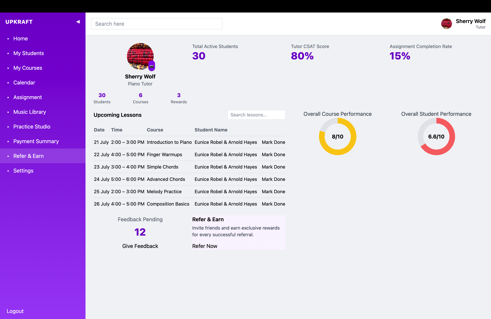
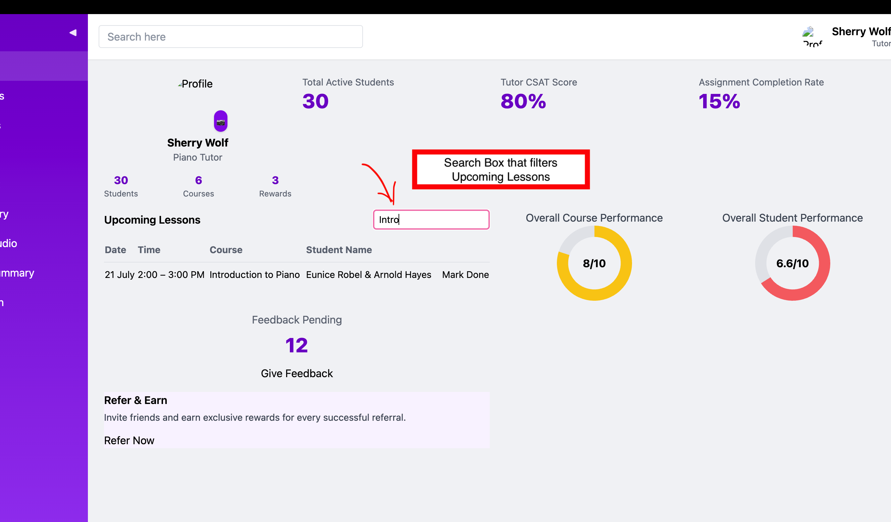
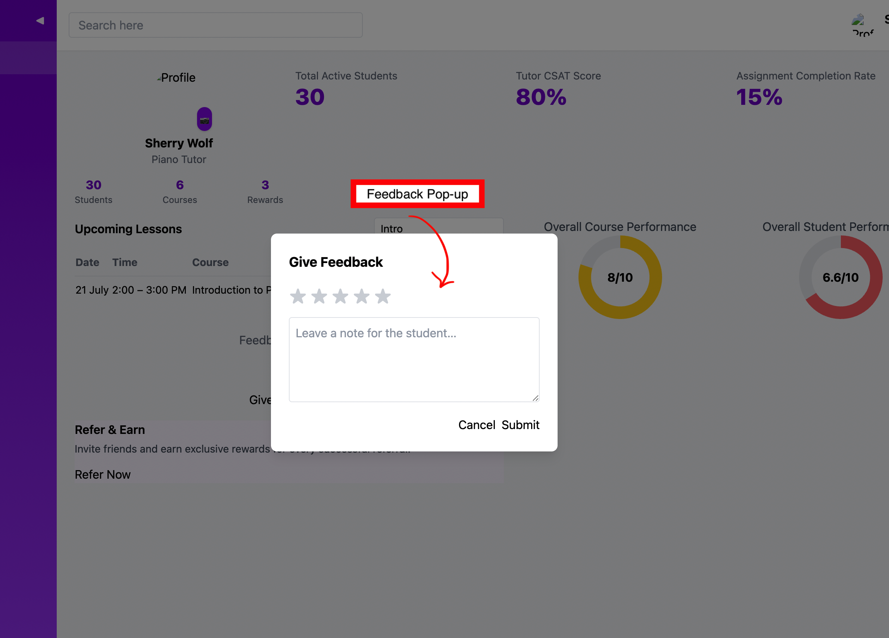
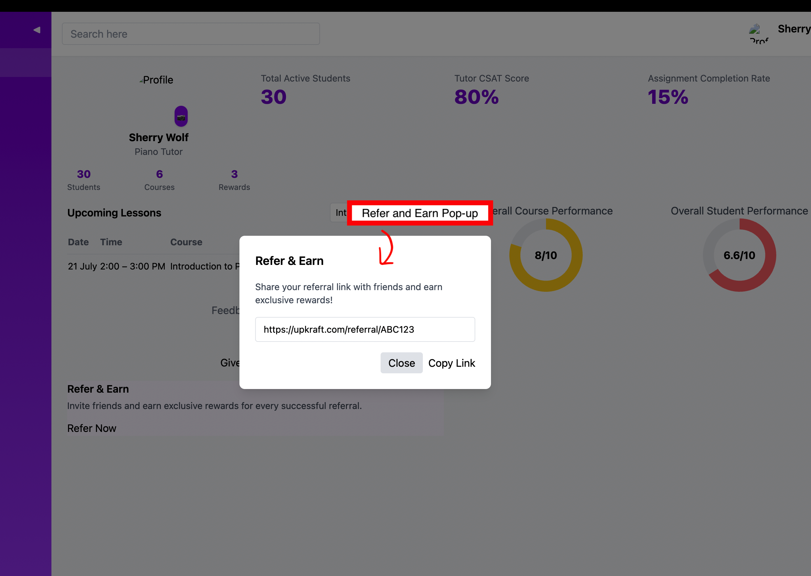
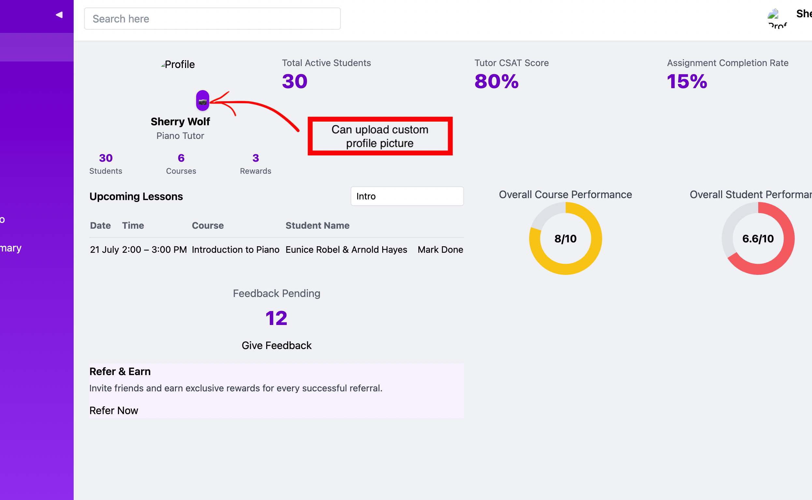

# Upkraft Dashboard

An interactive and data-driven dashboard built with React.

## Tech Stack
- **Frontend**: React (with functional components & hooks)
- **Styling**: CSS Modules


## Folder Structure

```plaintext
src/
├── App.js                 # Main application component
├── index.js               # React entry point
├── index.css              # Global styles
├── App.css                # App-specific styles
│
├── components/            # Reusable UI components
│   ├── FeedbackCard.jsx
│   ├── FeedbackModal.jsx
│   ├── Navbar.jsx
│   ├── PerformanceCard.jsx
│   ├── ProfileCard.jsx
│   ├── ReferEarnCard.jsx
│   ├── ReferModal.jsx
│   ├── Sidebar.jsx        # Sidebar with nested menu support
│   ├── StatsCard.jsx
│   ├── Toast.jsx
│   └── UpcomingLessons.jsx
│
├── pages/                 # Main dashboard pages
│   └── Dashboard.jsx

```

## Insteractive Components

<p align="center">
  
  <br />
  <em>Dashboard</em>
</p>

<p align="center">
  
  <br />
  <em>Search Box</em>
</p>

<p align="center">
  
  <br />
  <em>Feedback</em>
</p>

<p align="center">
  
  <br />
  <em>Refer & Earn</em>
</p>

<p align="center">
  
  <br />
  <em>Profile Picture</em>
</p>


## Installation & Setup

```bash
# Clone the repository
git clone https://github.com/cb-04/UpKraft_Assignment_Submission.git

# Navigate into the project folder
cd upkraft-dashboard

# Install dependencies
npm install

# Run the app locally
npm start
```


The app will be live at http://localhost:3000


